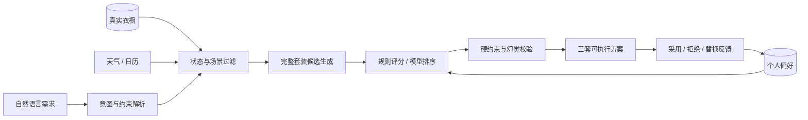

# 衣序 · OOTD Agent

> 一个只基于用户真实衣橱做决策、能够从反馈中持续学习的个人穿搭 Agent。

[](https://react.dev/)
[](https://www.typescriptlang.org/)
[](https://fastapi.tiangolo.com/)
[](https://www.mysql.com/)

衣序不是“让大模型凭空推荐衣服”的聊天应用。系统先读取用户真实衣橱、衣物状态、天气、场合、活动量和偏好，生成满足硬约束的完整穿搭候选；大模型只能在合法候选中选择，输出还会经过二次校验，避免虚构单品。


## 项目亮点

- **真实衣橱闭环**：推荐结果只能引用当前用户真实存在且可穿的 `item_id`。
- **规则与模型协同**：规则负责硬约束和候选生成，大模型负责复杂语义理解与风格判断。
- **三档推理模式**：`fast`、`balanced`、`deep` 在速度、成本与理解能力之间切换。
- **渐进式个性化**：从采用、拒绝、替换和穿着记录中学习，时间衰减与影响上限避免一次反馈覆盖长期偏好。
- **可解释排序**：保存候选曝光、特征、版本、策略概率与证据，支持回放和反事实分析。
- **可靠图片链路**：MySQL 维护资源状态和引用关系，R2 保存对象，Celery 负责异步处理与幂等补偿。

## 决策流程



系统默认输出“最稳妥 / 更显比例 / 更有风格”三套方案，并支持在多轮对话中锁定、替换或移除单品。

## 功能概览

| 场景 | 能力 |
| --- | --- |
| 数字衣橱 | 批量上传、视觉识别、属性编辑、可穿状态管理、使用率分析 |
| 今日推荐 | 结合天气、场合、步行量与临时要求生成三套完整搭配 |
| 对话造型 | 支持“保留鞋子、替换上衣”等基于上下文的局部修改 |
| 长期规划 | 周计划、旅行胶囊、多场景最少换装、衣橱补缺分析 |
| 决策辅助 | 穿搭检查、购买重复度与闲置风险判断、图片试穿 |
| 个性化 | Pairwise 学习排序、Thompson Sampling、偏好漂移检测 |

## 三种运行模式

| 模式 | 意图理解 | 搭配决策 | 适用场景 |
| --- | --- | --- | --- |
| `fast` | 本地规则 | 本地规则 | 低延迟、零模型调用 |
| `balanced` | 本地规则 | 模型排序，失败时规则回退 | 日常推荐 |
| `deep` | 模型语义理解 | 模型排序，失败时规则回退 | 复杂约束与细腻风格表达 |

## 技术架构

| 层级 | 技术 |
| --- | --- |
| Web | Vinext、Next.js 16、React 19、TypeScript、Vite、Tailwind CSS 4 |
| API | Python 3.12、FastAPI、Pydantic 2 |
| Agent | 约束解析、候选生成、OpenAI-compatible API、结构化输出校验 |
| 数据 | MySQL 8、Redis |
| 对象存储 | Cloudflare R2 |
| 异步任务 | Celery、Redis、SSE 进度 |
| 学习排序 | Bradley-Terry Pairwise Ranking、Thompson Sampling |
| 部署与质量 | Docker Compose、Cloudflare Worker、pytest、ESLint |

### 为什么采用“规则 + 模型”

纯生成式方案容易推荐用户没有的衣服，也难以严格满足“不要某颜色”“必须保留这双鞋”等约束。本项目将职责拆开：

1. 程序完成衣物白名单、状态过滤、天气和场合硬约束。
2. 候选生成器只组合数据库中真实存在的完整套装。
3. 大模型仅在候选范围内完成语义排序和理由生成。
4. 输出校验器检查数量、重复、约束泄漏和虚构 `item_id`。
5. 模型不可用时自动回退到规则路径。

## 个性化与可解释性

- 采用、局部替换、整套拒绝和撤销被映射为不同强度的反馈。
- 偏好证据按时间衰减，同场景完整计入、跨场景降低权重。
- 个性化对总分的影响设置上限，保护天气、场合和衣物状态等基础规则。
- 每次决策保存请求上下文、候选曝光、特征版本、模型版本和策略概率。
- Evidence Pack 返回评分主张、事实来源、计算方式与证据完整度。
- 反事实接口可固定其他特征，检查单个条件变化如何影响结果。

## 图片存储的一致性设计

```text
客户端申请上传
  → MySQL 创建 pending 资源并生成唯一 object_key
  → 客户端直传私有 R2 Bucket
  → 后端 HEAD 校验对象与大小
  → 同一事务更新 processing 状态并建立衣物引用
  → Celery 异步识别
  → ready / pending_delete / deleted
```

MySQL 是事实源，R2 只保存二进制对象，Redis 仅作为缓存和任务通道。定时对账任务负责清理超时上传、补投处理任务并重试删除，使外部服务短暂故障后仍可幂等恢复。

## 快速开始

### 环境要求

- Node.js 22.13+
- Python 3.12
- MySQL 8
- Redis（个性化缓存和异步任务需要）

### 1. 克隆并安装

```bash
git clone https://github.com/SUXS-sudo/ootd-agent.git
cd ootd-agent
npm install
python -m pip install -r backend/requirements.txt
```

也可以使用 `conda env create -f environment.yml` 创建完整环境。

### 2. 配置

```bash
cp .env.example .env
```

Windows PowerShell：

```powershell
Copy-Item .env.example .env
```

至少配置 MySQL 连接；不配置模型 Key 时，基础穿搭推荐仍可通过规则引擎运行，视觉识别、模型决策和图片试穿会停用或回退。

### 3. 启动服务

```bash
# 后端
cd backend
python -m uvicorn app.main:app --reload --port 8000

# 另一个终端，在仓库根目录启动前端
npm run dev
```

- 前端：<http://localhost:3000>
- API 文档：<http://localhost:8000/api/docs>
- 健康检查：<http://localhost:8000/api/v1/health>

Docker 完整环境：

```bash
docker compose -f platform/docker/docker-compose.yml up --build
```

## 测试

```bash
npm test
npm run lint
python -m pytest backend/tests -q

# 个性化决策链路评测（评测数据需自行准备）
python tests/evals/evaluate_decisioning.py
```

## 目录结构

```text
ootd-agent/
├─ app/                   Web 页面、组件与前端 API 封装
├─ backend/app/           FastAPI、Agent、推荐和数据模型
├─ backend/migrations/    MySQL 数据库迁移
├─ backend/scripts/       演示数据与真实模型检查脚本
├─ backend/tests/         后端自动化测试
├─ platform/              Docker、数据库初始化与部署适配
├─ public/                项目演示所需静态资源
├─ tests/evals/           离线评测程序（不含数据集）
└─ package.json           Web 脚本与依赖
```

## 隐私与设计底线

- 不推断用户体重、健康、三围或敏感身份信息。
- 临时照片默认在分析后删除，长期保存必须获得用户明确授权。
- 待洗、清洗中、借出、收纳和需修补衣物不会进入候选。
- 用户明确提出的“必须、不要、保留”优先于默认偏好。
- 大模型不能跨候选拼接或发明单品。
- 本仓库不包含用户数据、评测数据集、密钥及其他项目文档。

## 当前限制

- `balanced` 与 `deep` 模式效果取决于模型供应商的结构化输出能力和响应速度。
- Outlook 日历接入需要部署者自行配置 Microsoft Entra 应用。
- 图片试穿是生成结果，不能代替真实尺码与上身效果判断。
- 演示素材仅用于功能展示，生产环境需使用自有或已获授权的图片资源。
